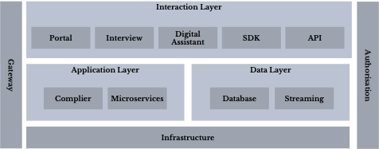
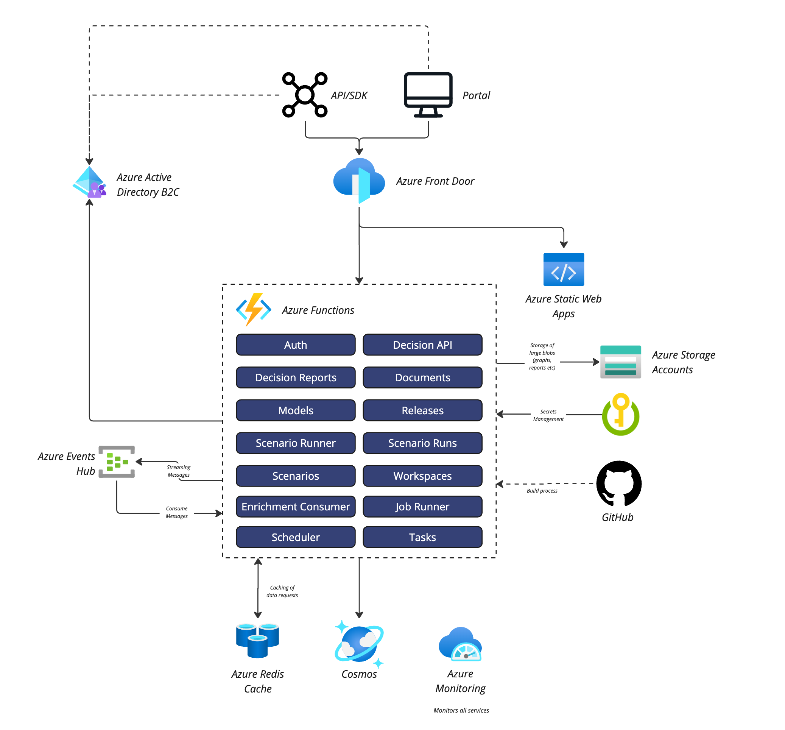
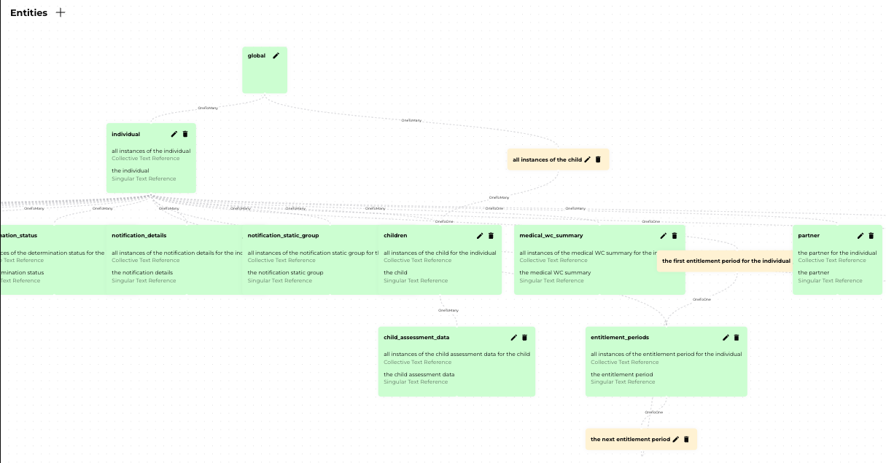
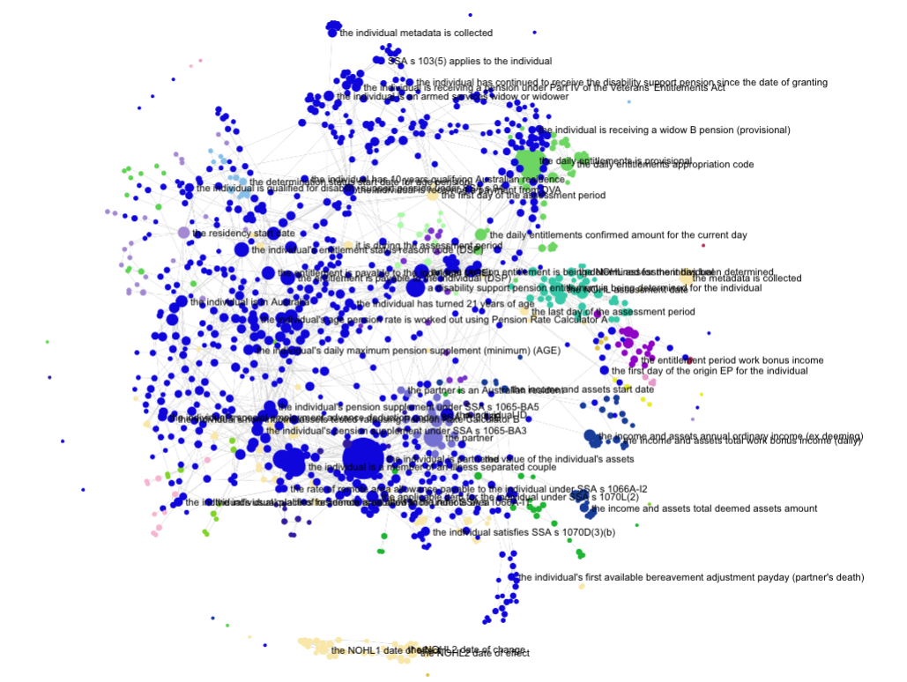
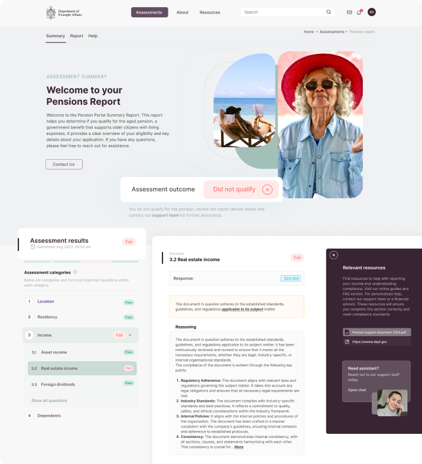

# Architecture Overview

The Decisively platform is purpose-built for complex, high-trust decision systems — particularly those driven by legislation and policy. It was designed from the ground up to support explainability, reusability, and scale.

Rather than replacing existing systems of record, it decouples the decision logic from legacy systems entirely, allowing organisations to modernise *how* decisions are made — without first modernising *where* they’re stored.

## 🎯 Key Principles

- **Top-down design** — decisions start with legislation, not implementation code
- **Graph-based reasoning** — all rules, dependencies, and exceptions are visualised and traceable
- **Headless architecture** — can be embedded into existing systems via API, SDK, or UI
- **Auditable by design** — every decision includes a full, linked audit trail
- **Human-readable rules** — designed to be written and understood by domain experts, not just engineers

## 🧱 High-Level Architecture

The platform is composed of several independently scalable components, working together to transform natural language into executable logic and return accurate, transparent decisions in real time.

**Core layers:**

1. **Rule Compiler**: Ingests legislation, policies, and agreements and converts them into structured logic.
3. **Decision API**: The primary runtime interface — receives structured data, runs logic, returns results + audit.
4. **Decision Reports**: Generates explainable decision reports, linked back to source rules and inputs.
5. **UI Interfaces** (optional):
   - **Interview Engine**: Guided Q&A mode for interactive experiences
   - **SDK**: Embed rule-driven logic in any front-end
   - **Chat**: Conversational access to rules and reasoning

---

## ⚙️ Under the Hood: Real Architecture in Production

While Decisively is policy-first and rule-driven, it’s also deeply engineered for performance, security, and flexibility.

Here’s a look at a real-world deployment architecture from one of our government projects:

This example shows a deployment **inside a government agency’s environment**, hosted on **Azure**, where:
- All infrastructure was **provisioned and controlled by the agency**
- There was **no callback or dependency on Imminently infrastructure**
- The deployment included **monitoring, CI/CD, RBAC, and full auditability**

### 🧱 Core Platform Components

At the centre of the system is a **modular function-based architecture**, made up of independent services like:

| Module            | Role                                                         |
|-------------------|--------------------------------------------------------------|
| `Decision API`    | Executes requests against the rule graph                     |
| `Models`          | Stores natural language rules and graph structure            |
| `Scenario Runner` | Used to simulate entitlements and test edge cases            |
| `Decision Reports`| Produces the human-readable audit trail                      |
| `Documents`       | Links source legislation and rules                           |
| `Workspaces`      | Isolated sandboxes for versioned rule development            |
| `Job Runner` and `Scheduler`     | Manages async batch operations and scheduled tasks           |

### 🔌 Integration & Event Flow

- Uses **Azure Events Hub** to stream events in/out (e.g. decisions, audit logs, system events)
- Metadata is stored in **Cosmos DB**, with **Redis caching** to support high-throughput evaluation
- Decisions and artefacts (e.g. PDFs, reports) are stored in **Azure Blob Storage**
- GitHub and Azure DevOps manage deployment pipelines, releases, and artefact control

---

## ☁️ Cloud Native — but Cloud Flexible

While this implementation ran on **Azure**, the Decisively platform is fully cloud-agnostic.

- We’re **cloud-native by design**, but not cloud-locked
- The platform can run in **Azure**, **AWS**, **OCI**, or **on-prem Kubernetes clusters**
- We support air-gapped or disconnected deployments for high-security environments

Whether you want us to host it or run it entirely inside your own infrastructure — we support both.

> This flexibility is key for government deployments: you stay in control.

## 🔁 Decision Example

Here’s how a typical decision is processed:

1. A user (or system) submits input data (e.g. age, income, residency)
2. The **Decision API** invokes the relevant ruleset from the rule graph
3. The system evaluates eligibility, conditions, and calculations
4. The decision is returned along with a **full audit report**

The decision report includes:
- Final outcome (e.g. "eligible for aged pension")
- Inputs used
- Which rules fired, and why
- Direct links back to the legislative source

[🔎 View a Sample Decision Report →](../assets/sample.decision.report.json)  
*Note: This is a redacted subset due to privacy constraints. If you’d like to see a full example or walk through a real decision report, [get in touch](mailto:info@imminently.io) — we’re happy to demo it.*

---

## 🔍 Example: Rule Graph Visualisation

Rules are not just executable — they’re explorable. 

Below is a typical rule graph generated by the system.  
Each node represents a conclusion, condition, or piece of input.  
This makes it easy to understand how decisions are constructed — and to explain them to others.

What’s more, the graph **naturally defines a data model**.  
So when downstream systems (like CRMs or service portals) need to request or store data, the required structure is already defined — directly from the rules themselves.

### 🌌 The Bigger Picture

Want to see the full scope?

The visual below shows the **entire interconnected rule graph** across multiple entitlements — every rule, every condition, every input node — rendered in one massive visualisation.

It’s not meant to be read.  
It’s meant to show the sheer **scale and complexity** we handle — and still return a decision in **under 500ms**!!

> Every dot is a rule or decision point. Every line is a dependency.  
> This is what explainable automation looks like — at scale.
---

## 🔐 Cloud-Native, Scalable, Secure

The platform supports multiple deployment configurations:

| Mode              | Description                                                                 |
|-------------------|-----------------------------------------------------------------------------|
| **Public Cloud**  | Multi-tenant SaaS hosted by Imminently (Azure-based)                        |
| **Dedicated Cloud**| Single-tenant cloud deployment, managed by us                              |
| **Private Cloud** | Customer-managed, air-gapped or secure infrastructure environments. Host on AWS, Azure, OCI, OpenShift or inside any K8 cluster          |

All editions are fully featured, with the same runtime and architecture.

---

## 🔎 Integration Options

Decisively was designed to be *headless* — integration is flexible and non-invasive.

| Method         | Use Case                                |
|----------------|------------------------------------------|
| **REST API**   | System-to-system decisions               |
| **SDK**        | Embedded experiences (e.g. in portals)   |
| **Interview UI**| Low-code UI for guided applications     |
| **Streaming**  | Real-time audit trail streaming          |

---

## 📦 Enterprise-Ready

- Scales horizontally with demand
- Fully version-controlled rule releases
- Supports temporal reasoning for time-based legislation
- Includes test harnesses, scenario simulations, and debugger tools
- Every rule change tracked, tested, and auditable

---

## 🧠 Why It Works

This isn’t just a rules engine — it’s a system for capturing, maintaining, and explaining complex policy logic at scale. The use of natural language and graph logic makes the system accessible to those who know the rules — not just those who write the code.

📎 [Next: Explore the rule graph model →](rule-graph-explainer.md)