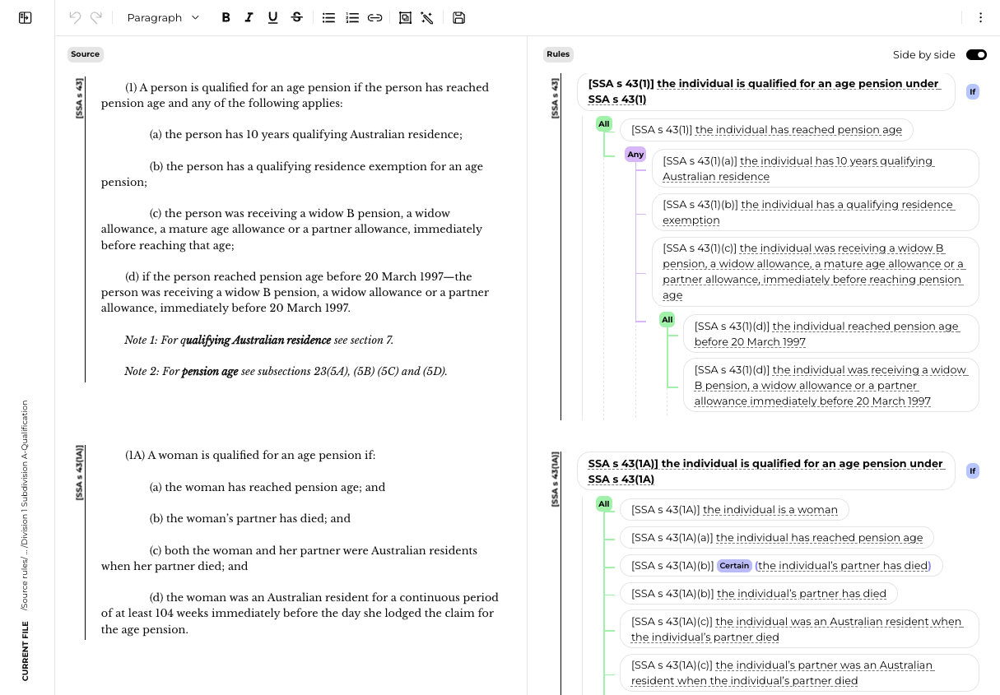
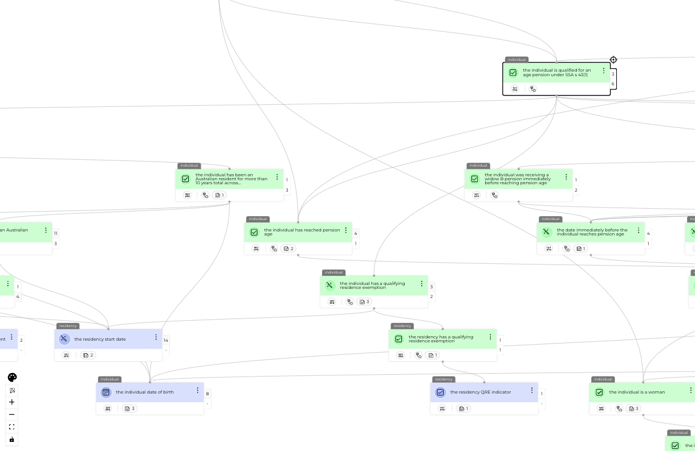
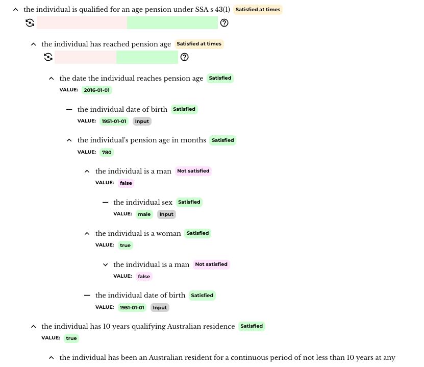
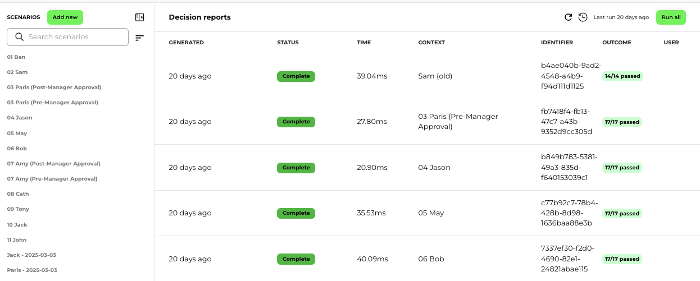
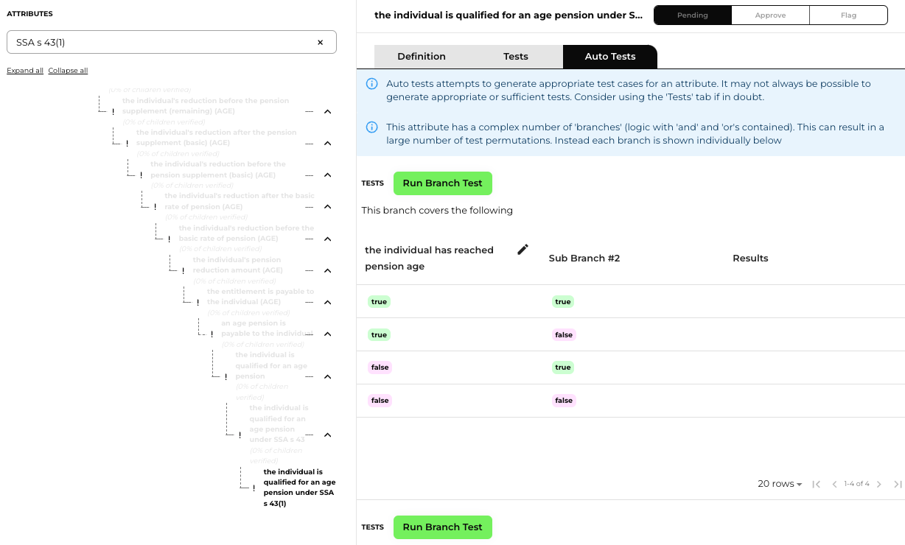

# Residency Example: From Legislation to Decision

This example shows how we transform complex legislation into an interpretable, executable, and explainable system — using the **Residency Requirement** for aged pension as a case study.

It demonstrates how our platform:
- Converts **legislation into natural language rules**
- Builds a **connected rule graph** for decision-making
- Produces a **fully auditable decision report**
- Operates in **real-time**, even with complex logic over time

---

## 1️⃣ From Legislation to Rules (Natural Language)

We start by ingesting the actual legislative source — in this case, section 43 of the Social Security Act — which outlines the conditions under which a person qualifies for the aged pension.

On the **left** below is the legislative source. On the **right** is how it was interpreted into natural language rules within our system.

These rules were initially generated using AI, then **reviewed by human policy experts** — part of our "human-in-the-loop" digitisation process.

Why this matters:
- The rules remain readable by both policy teams and engineers
- Ambiguities or edge cases can be flagged and resolved early
- It ensures **shared understanding and ownership** across IT and business

---

## 2️⃣ From Rules to Graph (Executable Logic)

Once rules are authored, they’re compiled into a **rule graph** — a powerful, interconnected structure that calculates all necessary conditions, dependencies, and inputs.

Each node represents:
- A **goal** (e.g. "the person is eligible")
- A **derived attribute** (e.g. "the person has 10 years residency")
- An **input** (e.g. "the person’s date of birth")

This graph is what allows us to:
- Evaluate incredibly complex legislation with **sub-500ms latency**
- Automatically determine the **data model** (what data we need, and when)
- Explain how we reached a decision — node by node

---

## 3️⃣ From Inputs to Decision (With Full Traceability)

Once data is supplied — either through an **AI Chatbot**, a **guided interview**, or an **API call** — the platform runs the decision graph and generates a **detailed decision report**.

This report doesn’t just say "yes" or "no". It shows:
- Each rule and whether it was satisfied
- The **input values** used
- How values changed **over time** (pension rules aren’t static — they shift based on dates, rates, or circumstances)
- Which path through the rule graph was taken
- What part of the legislation informed each part of the outcome

The coloured bars represent **temporal values** — showing how the calculation evolved over the timeline. This is essential for entitlements work, where values like income, residency, or relationship status often change.

## 🧪 Try It Yourself

Want to see what a real decision report looks like in machine-readable format?

[🔎 View Sample Decision Report JSON →](../assets/sample.decision.report.json)  
*Note: This is a redacted excerpt. Due to privacy and government restrictions, line numbers and policy references have been removed.*

>Need more? We can return the full rule graph or export to other formats — bring your graph theory hat and the possibilities are endless.

---

## ✅ Testing: From Scenarios to Graph Coverage

Policy is complex. Testing it shouldn't be guesswork.

Our platform brings **real testing discipline** to the world of rules and entitlements — bridging the gap between policy logic and engineering confidence.

We support two powerful testing modes:

---

### 1️⃣ Scenario Testing

Define an individual’s full context (inputs, dates, statuses, income, etc.), then execute the full rules engine and check that outcomes match expectations.

- Great for validating known use cases
- Ideal when migrating from legacy test cases
- Supports full audit and regression history

These tests ensure you get the **right outcomes** across the most important cases — fast.

---

### 2️⃣ Graph (Branch) Testing

Sometimes you don’t want to test the whole decision — just **one piece** of the logic.

That’s where graph testing comes in.

You can test **individual nodes** of the rule graph in isolation, with auto-generated permutations of inputs across logical branches.

- Quickly verify that a specific rule works as expected
- Validate logic before composing more complex entitlements
- Works even when full input data isn’t available

This is especially important because many entitlements rules produce **millions of potential combinations** when fully composed.  
Graph testing helps you verify correctness **one piece at a time** — just like a good unit test.

---

### 👨‍💻 Why It Matters

Traditional scenario testing is useful — but not enough.

Our approach adds **modular, targeted coverage** of your rules logic:
- Faster validation during authoring
- Isolation of bugs and ambiguity
- Confidence before pushing into production

This is **enterprise-grade testing** — for legislation.

---

## 🔁 Why This Is Better Than Just Translating Code

Legacy systems often contain logic that:
- Is no longer aligned with current law
- Is opaque to business users
- Can’t explain why a decision was made

Our approach solves that by:
- **Writing rules in natural language**
- **Linking them directly to legislation**
- **Executing them via a deterministic, testable graph**
- **Producing human-readable decision reports with full traceability**

And unlike AI-generated code, these rules can be **read, audited, and validated** by non-technical experts — **the people who understand the law.**

---

## 🇦🇺 A Real-World Result, In 8 Weeks

We used this exact approach to digitise one of the most complex pension systems in the world.

In just 8 weeks, we:
- Ingested thousands of rules from legislation and policy
- Ran side-by-side with a national mainframe system
- Achieved **100% accuracy**
- Delivered **sub-second performance**
- Produced detailed audit reports for every decision

---

## 🚀 Want to See How It Works for You?

This isn't a static ruleset — it's a reusable model. If you're modernising entitlements or decision logic, we’d love to help.

📬 [Reach out to book a walkthrough or architecture session](mailto:info@imminently.io)  
Or keep exploring:
- [📊 Architecture Overview](architecture-overview.md)
- [🧠 How the Rule Graph Works](rule-graph-explainer.md)
- [🤖 Why AI Alone Won’t Fix This](why-ai-fails.md)