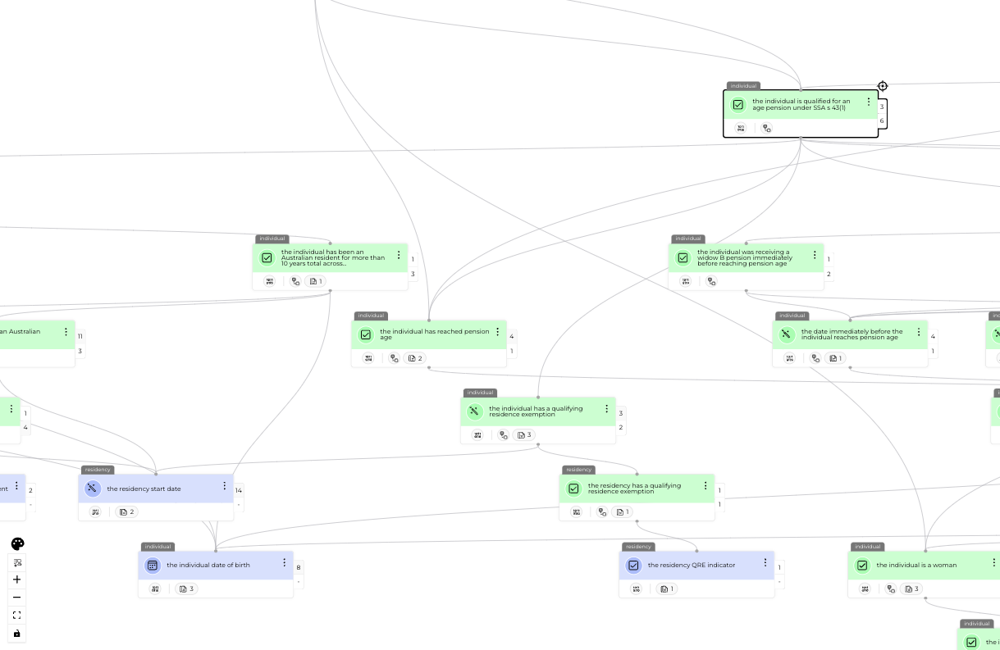

# Understanding the Rule Graph

The rule graph is the core execution and visualisation layer of Decisively. It transforms natural language rules into a structured, explainable, and machine-executable format — one that mirrors the intent and structure of the original legislation or policy.

It’s what allows the platform to be:
- ✅ Transparent
- ✅ Accurate
- ✅ Reusable
- ✅ Trustworthy

---

## ✍️ Writing Rules in Natural Language

Rules in Decisively are written in plain, declarative language — not in code or custom syntax. This means they’re readable by subject matter experts (SMEs), policy writers, and analysts — not just developers.

These rules are entered directly into the platform and are **stored inside graph nodes**. The natural language format makes it easy for SMEs to read, review, and validate logic without translation or technical support.

  

This proved especially valuable in practice — SMEs, many with no programming background, were able to engage deeply with the logic and improve rule accuracy at speed.

---

## 🔧 How the Rule Graph Works

The rule graph is a **directed acyclic graph (DAG)** made up of three kinds of nodes:

1. **Goals** – High-level decisions the system needs to reach  
   e.g. *“the person is eligible for the aged pension”*
2. **Derived Attributes** – Intermediate logic the system determines along the way  
   e.g. *“the person meets the residency requirement”*, *“the person’s total income”*
3. **Inputs** – Data provided by users or other systems  
   e.g. *“the person’s age”*, *“the person’s visa status”*

Each node stores:
- One or more natural language rules
- The data dependencies needed to evaluate them
- A link back to the source legislation or guidance

There are **no operator nodes** (like `and` or `or`) in the graph itself — those logical structures are handled internally within each node’s rule logic.

This structure allows the system to:
- Execute fast, accurate decisions
- Identify missing data and request it dynamically
- Provide clear explanations for every step in the logic

---

## 🤖 AI-Assisted Rule Creation (But Not AI Decisions)

We use AI to **help generate rules** — not to make decisions.

- When importing legislation or policy documents, our AI assistant can parse and propose rules automatically
- It can identify potential attributes, linkages, and logical structures
- These draft rules are then reviewed, refined, and approved by humans

This dramatically reduces the time required to digitise new content — particularly at the start of a project — while keeping control and accountability in human hands.

> ✅ **Important:** All actual decisions are made via deterministic rule evaluation.  
> There is no AI inference or black-box logic used at runtime.

Every decision is:
- Traceable
- Repeatable
- Fully auditable

---

## 📊 Why This Model Works

| Feature                | Benefit                                                 |
|------------------------|----------------------------------------------------------|
| Natural language rules | SMEs can write, read, and validate rules directly       |
| Graph structure        | Logic is modular, reusable, and visually explorable     |
| Node-based execution   | Faster, more transparent, and easier to test/debug      |
| Deterministic runtime  | Every decision is explainable and testable              |
| AI-assisted authoring  | Speed without sacrificing trust or accuracy             |

This structure enabled us to digitise a complex legislative framework in just 8 weeks — and achieve **100% accuracy** when tested against a legacy system, while providing dramatically better traceability and user comprehension.

---

## 📎 Related Files

- [Architecture Overview](architecture-overview.md)
- [Decision Report Example](../assets/sample.decision.report.json)